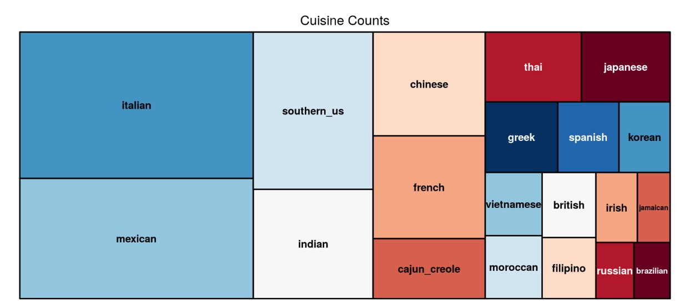

# We are trying to find out the most common ingredients used in different cuisine types.

  
  
The treemap shows the distribution of the various cuisines.
 
We chose the top 6 to analyze the ingredients.
 
The 6 types of cuisine are listed below :

   1.Italian
   
   2.Mexican
   
   3.Southen_US
   
   4.Indian
   
   5.Chinese
   
   6.French
   
   

